<div align="center">



### Generate a **Thru** ABI straight from your program's C structs — so the ABI stops drifting from the source.

[](https://thru.org/docs)
[](https://thru.org/docs/abi/overview/)
[](./LICENSE)


</div>

> Thru's docs are blunt about it: **"Thru ABIs are handwritten today. They do not
> automatically stay in sync with a program the way macro-generated IDLs do in some
> other ecosystems."** Official `thru abi codegen` only runs *ABI → C/Rust/TS*.
> Nothing runs the other way. `thru-abi-gen` is that missing direction: **C → ABI.**

## Why

Every hand-authored ABI is a second copy of your struct layout that a human has to
keep byte-for-byte identical to the C the program actually compiles. Miss a field
width, forget that `uint` is `u32`, hardcode `32` instead of `TN_SEED_SIZE`, and the
schema still *looks* valid — it just decodes the wrong bytes at the explorer, in
codegen, and in every downstream client. `thru-abi-gen` reads the struct that already
exists and emits the ABI, so the layout has one source of truth.

It is deliberately conservative. It converts the tedious, error-prone part (packed
layout, primitive widths, fixed arrays, `#define` sizes) and scaffolds the
explorer-required metadata. It never invents authorization semantics — per the docs,
an ABI only describes wire format, not the account-access model.

## Architecture

```
  program.h  (typedef struct __attribute__((packed)) { ... })
       │
       ▼
  ┌─────────────────────────────────────────────┐
  │  thru-abi-gen                                │
  │   ├─ #define scan      TN_SEED_SIZE → 32     │
  │   ├─ packed-struct parser (layout-agnostic)  │
  │   ├─ C → ABI primitive map (little-endian)   │
  │   ├─ fixed-array resolver                     │
  │   └─ instruction envelope + root-types        │
  └─────────────────────────────────────────────┘
       │
       ▼
  program.abi.yaml ──▶ thru abi analyze  (roundtrip)
                   ──▶ thru abi codegen   (client types)
                   ──▶ thru abi account create <seed>  (publish)
```

## What it maps

| C type | ABI | C type | ABI |
| --- | --- | --- | --- |
| `uint8_t` / `uchar` | `u8` | `int8_t` | `i8` |
| `uint16_t` / `ushort` | `u16` | `int16_t` / `short` | `i16` |
| `uint32_t` / `uint` | `u32` | `int32_t` / `int` | `i32` |
| `uint64_t` / `ulong` | `u64` | `int64_t` / `long` | `i64` |
| `char` | `char` | `float` / `double` | `f32` / `f64` |
| `T name[N]` / `T name[#define]` | fixed `array` of the mapped element | | |

Unmapped types (`size_t`, unknown typedefs) **fail loudly** rather than guessing a
width — a wrong guess is worse than an error.

## Usage

```bash
python3 src/thru_abi_gen.py program.h \
  --package thru.example.counter \
  --instruction-root CounterInstruction \
  --instructions "0=TnCounterCreateArgs:create,1=TnCounterIncrementArgs:increment" \
  --out program.abi.yaml --check
```

`--check` shells out to the real `thru abi analyze` when the CLI is on PATH.

Point root types either with flags or with inline annotations in the header:

```c
// @abi:account-root
typedef struct __attribute__((packed)) { ulong counter_value; } tn_counter_account_t;
```

| Flag | Purpose |
| --- | --- |
| `--package` | ABI package name (required) |
| `--instruction-root` + `--instructions` | synthesize the single discriminated instruction envelope explorer reflection expects |
| `--account-root` / `--events` / `--errors` | set `program-metadata.root-types` (also settable via `// @abi:` annotations) |
| `--check` | run `thru abi analyze` on the output |

## Flow

1. Start from the packed C header your program already ships.
2. Run `thru-abi-gen` with your root-type mapping.
3. It emits explorer-compatible ABI YAML (`root-types` + one discriminated instruction envelope).
4. `thru abi analyze` / `abi reflect` to prove the bytes roundtrip.
5. `thru abi account create <seed> program.abi.yaml` to publish alongside the program.

## Proof

Run against Thru's own documented counter header, `thru-abi-gen` reproduces the exact
explorer-compatible shape the docs hand-author by hand — `CounterInstruction`
envelope, `TnCounterAccount` root, and `counter_program_seed` correctly resolved to
`u8 × 32` from `TN_SEED_SIZE`:

```bash
bash demo.sh      # full cycle in < 1s
```

### Live on alphanet

The same header compiles to a real program, and the generated ABI publishes and
reflects against it. Reproduce with [`DEPLOY.md`](./DEPLOY.md) (the buildable program
lives in [`examples/counter-program/`](./examples/counter-program/)):

| | |
| --- | --- |
| Program account | `ta…<fill after deploy>` |
| ABI account | `ta…<fill after deploy>` |
| Increment tx (event decoded via this ABI) | `ts…<fill after deploy>` |
| Explorer | [scan.thru.org](https://scan.thru.org) |

Transaction fees on alphanet are currently 0, so the full deploy → publish → reflect
loop costs nothing.

## Scope & roadmap

- ✅ packed structs, primitive widths, fixed arrays, `#define` sizes, annotations, discriminated instruction root
- 🔜 flexible-array members (runtime `field-ref` sizes, e.g. a `len` field followed by `data[len]`)
- 🔜 nested `type-ref` across imported packages; `--emit c-check` to diff a compiled struct's `sizeof` against the ABI footprint

## Local dev

```bash
git clone https://github.com/Makabeez/thru-abi-gen
cd thru-abi-gen
bash demo.sh
```

Zero runtime dependencies (Python stdlib + a hand-rolled deterministic YAML emitter).
`pyyaml` is used only by the demo's structural check.

## Attribution

Built against the public [Thru developer docs](https://thru.org/docs). The counter
header and target ABI shape are taken from Thru's own quickstart and
[Explorer Compatibility](https://thru.org/docs/abi/explorer-compatibility/) guide.
Independent community tool, not affiliated with Unto Labs.

## License

MIT — see [LICENSE](./LICENSE).
